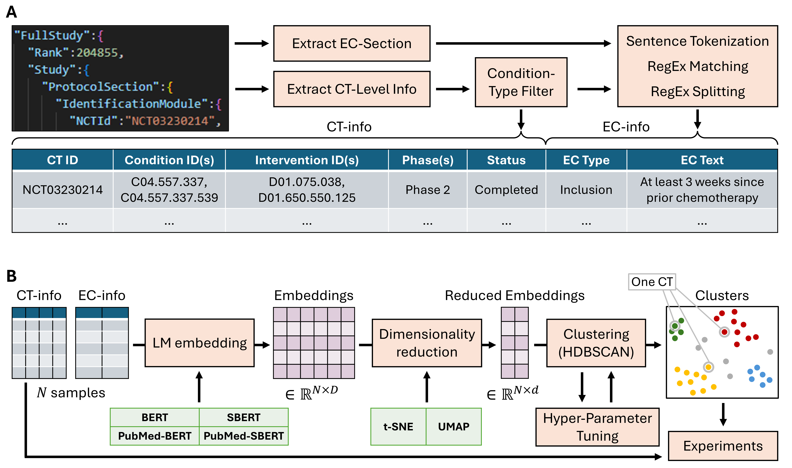

# CTxAI - Eligibility criteria

This project aims to provide feedback about elibility criteria of a new study, based on the history of similar clinical trials.

## Description

The code performs the following steps:
* First, elibibilty criteria are parsed from the CT.gov database and split into a set of individual criteria.
* Then, a language model pre-trained on a clinical corpus embeds all criteria coming from studies that are similar to a new clinical trial.
* These embedded criteria are clustered using HDBScan, and the clusters are used to compute statistics about the selected similar studies.
* Finally, cluster centroids are used as "typical" criteria that are used in similar studies, and the new clinical trial can be checked using this information.


## Getting Started

### Install dependencies

* To come

### Executing program

* Step-by-step bullets
* To come
```
code blocks for commands
```
